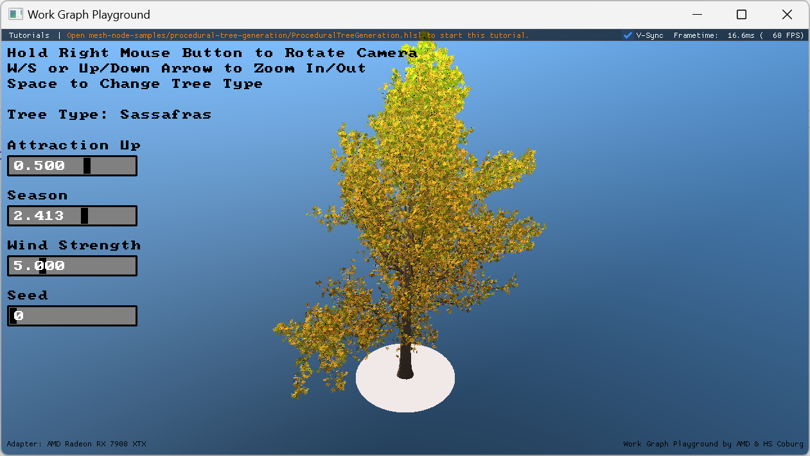

# Real-Time GPU Tree Generation

This repository contains a minimal sample for our GPU Work Graphs paper "Real-Time GPU Tree Generation" by Bastian Kuth, Max Oberberger, Carsten Faber, Pirmin Pfeifer, Seyedmasih Tabaei, Dominik Baumeister and Quirin Meyer.

You can download the full paper [here](https://diglib.eg.org/bitstream/handle/10.2312/hpg20251168/hpg20251168.pdf)



Please note that the code is only a simplified subset of the materials presented in the paper.

## Running the Sample

To run the sample, you need to download or build a version of the [Work Graph Playground](https://github.com/GPUOpen-LibrariesAndSDKs/WorkGraphPlayground) with mesh nodes enabled.
You can find pre-built binaries [here](https://github.com/GPUOpen-LibrariesAndSDKs/WorkGraphPlayground/releases). You can find more information on Mesh Nodes in the Work Graph Playground [here](https://github.com/GPUOpen-LibrariesAndSDKs/WorkGraphPlayground/blob/main/readme.md#using-mesh-nodes).

You also need a GPU and driver with D3D12 Work Graphs 1.1 (Mesh Nodes) support. You can learn more about driver availability on [Microsoft's announcement blog post](https://devblogs.microsoft.com/directx/d3d12-mesh-nodes-in-work-graphs/) or on [our own blog post on GPUOpen.com](https://gpuopen.com/learn/work_graphs_mesh_nodes/work_graphs_mesh_nodes-getting_started/).

To run the sample, open a terminal and run the following command:
```bash
path/to/WorkGraphPlayground.exe path/to/ProceduralTreeGeneration.hlsl
```

If you built the playground from source, please make sure that the working directory is set to the Work Graph Playground repository directory, or re-configure and re-build the playground with
```bash
cmake -B build . -D PLAYGROUND_ENABLE_MESH_NODES=ON -D PLAYGROUND_COPY_TUTORIAL_MODE=copy
```
to copy the necessary header files from the playground to the executable output directory.

### BibTex Reference

```
@inproceedings{Kuth25RTT,
  title     = {Real-Time GPU Tree Generation},
  author    = {Bastian Kuth and Max Oberberger and Carsten Faber and Pirmin Pfeifer and Seyedmasih Tabaei and Dominik Baumeister and Quirin Meyer},
  booktitle = {High Performance Graphics - Symposium Papers},
  year      = {2025},
  publisher = {ACM},
  address   = {Copenhagen, Denmark},
  month     = jun
}
```